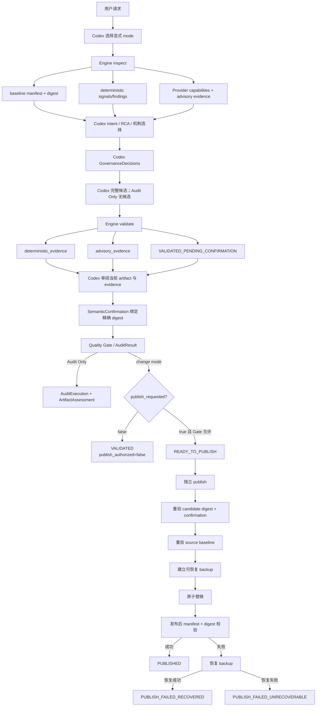

# Skill Engineering Architecture Correction

> **当前权威架构（2026-09-16 更新）**：本页取代此前把 signals、治理决策、确认和 Gate 合并在一次 `run()` 中的图示。实现权威仍是 `scripts/skill_engineering.py` 与 `engine/`。

## Purpose

Codex is the author, decision-maker, and semantic evaluator for Skill engineering. The Skill Engineering Plugin is an installable capability package that gives Codex deterministic workspace, evidence, validation, and publication safeguards. It is not an agent and does not simulate model reasoning in Python.

## Confirmed root cause

The historical V1 specification treated “internal governance” as an autonomous Python decision layer. It assigned intent detection, RCA, classification, mechanism selection, rule actions, Gate PASS, and release authorization to the Internal Core. The entry Skill, implementation, and tests then encoded that mistaken subject relationship consistently. The correction therefore changes the executable contracts and regression expectations together; changing prompt wording alone would leave the cause intact.

## Responsibility model

| Participant | Responsibility |
|---|---|
| User | State the task, constraints, and authorization. |
| Codex | Interpret intent; choose one of five modes; perform RCA and issue classification; select mechanisms; author the complete candidate; decide `KEEP / MERGE / MOVE / DELETE`; evaluate evidence; confirm the semantic goal for the current artifact digest; request publication. |
| `skill-engineer` | Tell Codex how and when to use Plugin capabilities through one entry Skill. |
| Plugin | Package the entry Skill, scripts, Engine, schemas, validators, tests, references, configuration, and manifest. |
| Provider Skills | Supply optional authoring help, review findings, or candidate suggestions. They never decide semantics or release. |
| Engine and validators | Copy and inventory files, isolate candidates, validate records, execute real checks, collect status and evidence, compute diffs, enforce release preconditions, and perform atomic publication. |
| Quality Gate | Block release when deterministic evidence fails, is missing, was not executed, or lacks current Codex semantic confirmation. It does not infer whether the user goal was met. |

## Five modes

- `CREATE`: Codex authors a complete Skill candidate in an independent directory. The Engine stages and validates that candidate.
- `MODIFY`: Codex authors a candidate separate from the source. The Engine records the source digest, stages the candidate, and computes the diff.
- `FIX`: Codex reproduces or confirms the defect, records RCA and a regression disposition, then authors an isolated candidate.
- `AUDIT_ONLY`: The Engine reads the source directly, creates no staging directory, and never publishes.
- `AUDIT_OPTIMIZE`: Codex audits first. If change is justified and authorized, Codex supplies an isolated optimized candidate and explicit governance decisions for actionable rule signals.

Mode selection is an explicit Codex input. The Engine validates the enum and source/candidate preconditions and contains no keyword intent classifier.

## Semantic handoff contracts

`DecisionRecord` is authored by Codex. It records the mode, primary issue class, control gaps, regression disposition, root cause or evidence limitation, selected and rejected mechanisms, and any Prompt Rule justification. `engine.mechanism_selection` validates the record without replacing the selected mechanisms.

Rule scanners emit `RuleFinding` signals, confidence, evidence locations, and limitations. They contain no candidate action and no target layer. Codex may submit `GovernanceDecision` records; the Engine validates references and requires explicit coverage of actionable findings before accepting any candidate-bearing flow.

`SemanticConfirmation` binds Codex's nonblank rationale to the exact candidate content digest. A missing, stale, or non-Codex confirmation forces Gate `FAIL`, even when every deterministic check passes.

## Deterministic lifecycle

`inspect()` 在 Codex 提交 RCA、机制和治理决策之前产生稳定 finding ID。`validate()` 只产生 staged artifact、两类 evidence、diff 和 `VALIDATED_PENDING_CONFIRMATION`；它不计算最终 Gate，也不发布。`confirm()` 在验证完成后校验当前 bytes 与 Codex 的 digest 绑定，再计算 Gate。`publish()` 始终独立调用。

Audit Only 的 behavior/regression 命令在一次性审计快照中执行。Engine 在每条外部命令后、结果生成前和确认时复核源 snapshot；源变化只会使结果进入 `INCOMPLETE / UNKNOWN`，不会自动恢复或覆盖源目录。

The compatibility `run()` operation delegates to `inspect → validate → confirm` and never publishes. Modification authorization permits isolation and staging but does not request publication. `publish_requested` is a separate input; without it, Gate PASS produces `VALIDATED` with `publish_authorized=false`. `publish(outcome)` accepts only a `READY_TO_PUBLISH` outcome. It rechecks the source and candidate, moves the existing target to a recoverable backup first, performs the atomic replacement second, validates the published bytes, and restores the backup after failure.

## State mapping

| Layer | State | Entry condition | Exit condition | Terminal |
|---|---|---|---|---|
| Lifecycle | `INSPECTED` | baseline and findings captured | Codex submits decisions to validate | No |
| Lifecycle | `VALIDATED_PENDING_CONFIRMATION` | artifact checks complete | Codex submits current digest confirmation | No |
| Lifecycle | `VALIDATED` | Gate passes and `publish_requested=false` | a new explicit request starts a new confirmation | Yes for this run |
| Lifecycle | `READY_TO_PUBLISH` | Gate passes and publication was requested | independent `publish()` | No |
| Lifecycle | `PUBLISHED` | post-publish validation succeeds | none | Yes |
| Lifecycle | `PUBLISH_FAILED_RECOVERED` | publish fails and restoration succeeds | none | Yes |
| Lifecycle | `PUBLISH_FAILED_UNRECOVERABLE` | publish and restoration both fail | operator recovery | Yes, severe |
| Lifecycle | `AUDIT_COMPLETE_VALID` | execution complete; no target findings | none | Yes |
| Lifecycle | `AUDIT_COMPLETE_FINDINGS` | execution complete; nonblocking findings | none | Yes |
| Lifecycle | `AUDIT_COMPLETE_BLOCKING_FINDINGS` | execution complete; serious target defects | none | Yes |
| Lifecycle | `AUDIT_INCOMPLETE` | command/source/integrity failure | rerun from inspect | Yes |
| Gate | `PASS / READY_TO_PUBLISH` | release checks and confirmation pass | publish or remain staged | No |
| Gate | `PASS / VALIDATED` | checks pass but publication was not requested | new explicit request | Yes for this run |
| PublishResult | `PUBLISHED` | replacement and post-check pass | none | Yes |
| PublishResult | `PUBLISH_FAILED_RECOVERED` | recovery completes | none | Yes |
| PublishResult | `PUBLISH_FAILED_UNRECOVERABLE` | recovery fails | operator recovery | Yes |

Legacy `GATE_PASSED`, `UNCHANGED_VALIDATED`, and `UNCHANGED_BLOCKED` remain only for compatibility with pre-2.0 policy/state tests. The phased entry points do not use them as terminal states.

## Provider boundaries

Provider outputs cannot contain final Gate verdict, publication authorization, source replacement, or lifecycle-transition fields. Provider evidence is marked non-deterministic and non-reproducible. Unavailable or unpinned Providers produce an optional `NOT_EXECUTED` result with limitations. The Plugin does not fabricate semantic `CREATE_CANDIDATE` or `AUDIT_SKILL` success through internal Provider fallbacks; structure and reference checks remain normal Engine validators.

Use providers only where they fit:

- `skill-creator`: optional Create authoring guidance.
- `agent-skills-creator`: optional audit and simplification evidence.
- `agents-md`: only when project instruction files are in the actual change scope.
- `validate-skills`: only for checks it truly executes.
- `plugin-creator`: Plugin packaging and development lifecycle only.

## Corrected deviations

| Requirement | Previous implementation and behavior | Conformed | Deviation evidence | Risk | Correction | Priority |
|---|---|---|---|---|---|---|
| Codex selects the mode | Orchestrator inferred it from request words. | No | former `_detect_intent` | Misroutes user intent. | Require explicit `Intent`; validate only. | P0 |
| Codex performs RCA and classification | Engine mapped evidence and keywords to a root cause and issue class. | No | former `_make_decision` | Treats symptoms as causes. | Require a Codex-authored `DecisionRecord` with `decided_by=CODEX`. | P0 |
| Codex selects mechanisms | Engine used a fixed issue-class table. | No | former `_DEFAULT_SELECTIONS` | Replaces contextual engineering judgment. | Validate complete explicit selected/rejected sets without defaults. | P0 |
| Codex governs rules | Detector attached action and target; governance copied them. | No | former `RuleFinding.candidate_action` and `candidate_target_layer` | Regex and similarity scores caused semantic actions. | Emit signals only; validate explicit Codex decisions. | P0 |
| Create produces a complete Skill | Engine wrote one generic `SKILL.md` from raw requirement text. | No | former `_write_internal_candidate` | Structure could pass for an unusable Skill. | Require a complete Codex-authored candidate and a real behavioral result. | P0 |
| Modify/Fix preserve unrelated content | Engine copied the source but changed its name to `staged-skill`; it did not implement the requested change. | No | former orchestrator name rewrite | Publishes unrelated semantic changes. | Stage the complete candidate byte-for-byte and compute a source diff. | P0 |
| Providers remain optional advisers | Default internal fallbacks claimed Create/Audit capability. | Partial | former `InternalFallbackProvider` defaults | Fabricated expertise and PASS-like evidence. | Remove semantic fallbacks; report unavailable Providers as not executed. | P1 |
| Audit Only is read-only | Workspace did not stage, but the orchestrator still made semantic decisions. | Partial | former audit path plus `_make_decision` | Read-only result could contain fabricated conclusions. | Preserve no-write path and require Codex decisions and confirmation. | P0 |
| Checks alone do not prove semantics | Gate emitted PASS whenever deterministic evidence had no blockers. | No | former `GateContext` without semantic input | Structure PASS became overall PASS. | Require digest-bound `SemanticConfirmation`. | P0 |
| Publication is explicit and atomic | `run()` called `publish_atomic` immediately after Gate PASS. | No | former automatic call in `PipelineOrchestrator.run()` | Review and release collapsed into one action. | Return a staged ready outcome; publish through a separate call. | P0 |
| Missing validators are not PASS | Behavioral module already returned `NOT_EXECUTED`; required regression absence blocked. | Yes | `engine/behavioral.py` and Gate B07/B08 | Main Create flow did not require behavioral evidence. | Preserve statuses and make missing Create behavior a blocking `NOT_EXECUTED`. | P1 |

## Preserved capabilities

The correction retains the Plugin layout, single entry Skill, schemas, provider output normalization, evidence collector, explicit check statuses, structure and reference validators, policy strengthening, isolated temporary directories, source digests, file-level diffs, regression hooks, state-transition checks, atomic publication, backups, and failure recovery.

## Verification expectations

Tests must prove observable boundaries rather than documentation wording:

- explicit intent and complete candidate are required;
- Audit Only creates no staging directory and leaves the source digest unchanged;
- candidate staging preserves the Skill name and source content remains untouched;
- detector findings expose no governance action;
- mechanism validation preserves Codex choices;
- unavailable Providers are `NOT_EXECUTED`, not PASS;
- required regression absence or failure blocks the Gate;
- passing checks without current Codex semantic confirmation fail;
- a ready run does not publish until `publish(outcome)` is called;
- atomic publication still rejects stale sources and restores originals after failure.
